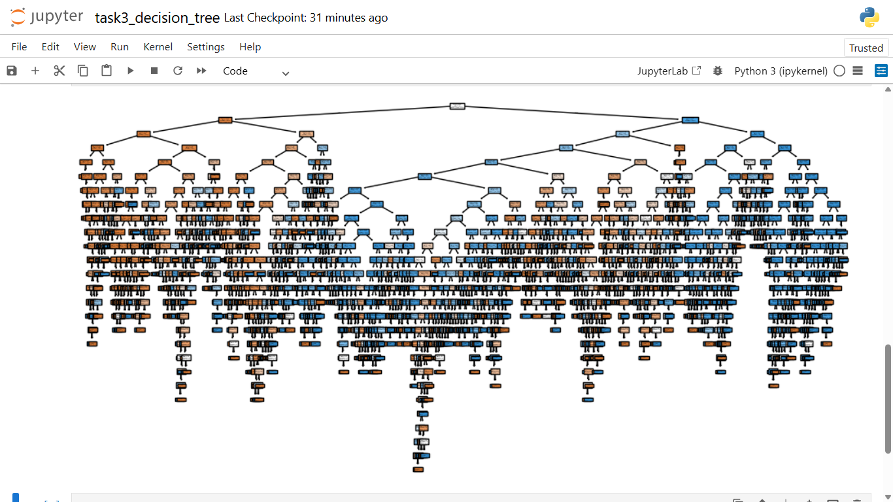

# Task 3: Decision Tree Classifier

## Objective

To build a decision tree model to predict customer behavior.

## Tools Used

- Python
- Pandas
- Scikit-learn

## Dataset

Sample dataset used for classification.

## Process

- Loaded dataset
- Converted categorical data
- Split into training and testing
- Trained decision tree model
- Evaluated performance

## Results

- Model achieved good accuracy
- Successfully classified target variable

## Visual Output

## Files Included

- task3_decision_tree.ipynb
- decision_tree_visualization.png
- task3_execution.mp4
